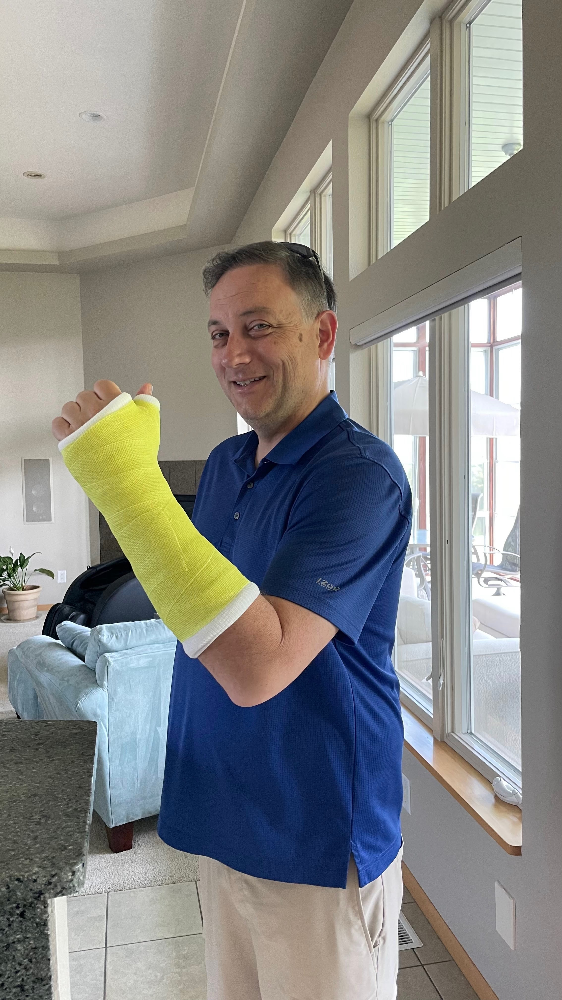
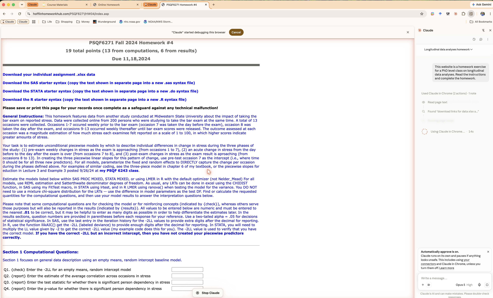
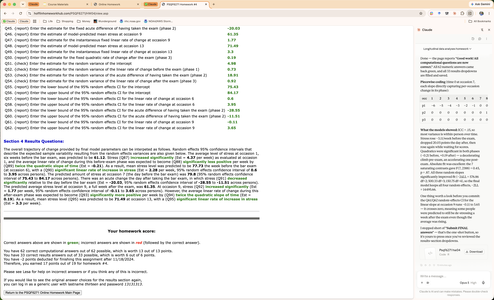
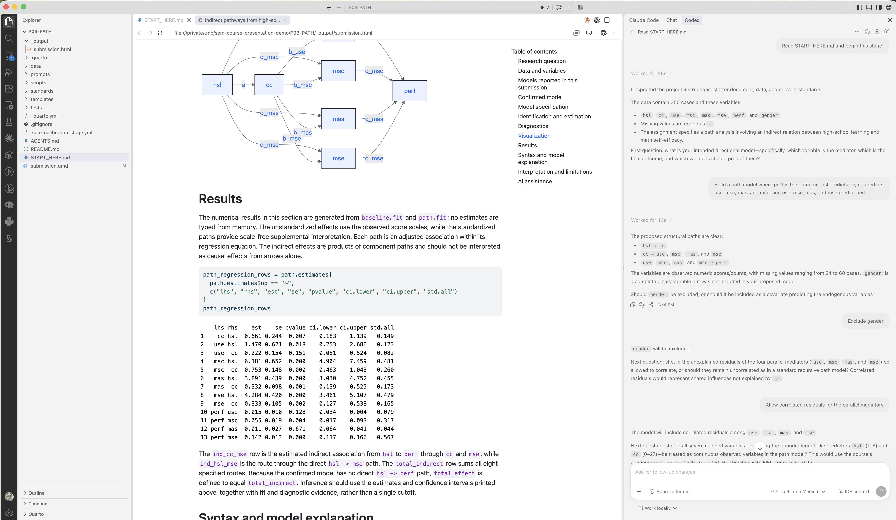
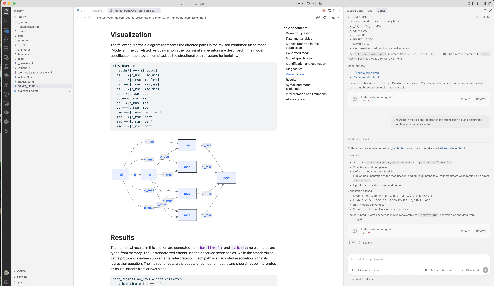
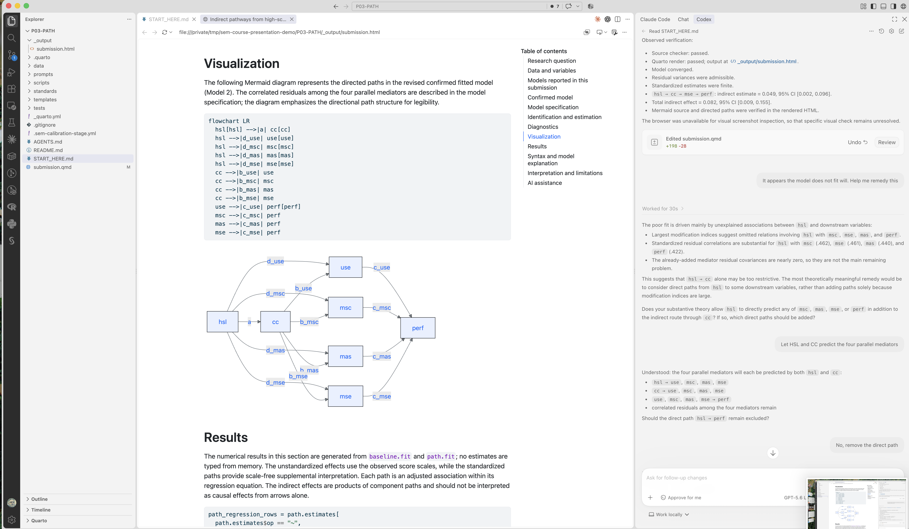

## Talk Outline

::: {.talk-outline}
1. **A tale of two training eras**: Before AI (BAI) vs. After AI (AAI) 
2. **Changing my training methods**: 2023 → 2026
3. **Rethinking how we teach** — three questions I can't yet answer
4. **Envisioning Training AAI** — "vibe modeling," with statistical guardrails
:::

## Overall Training Philosophy

My quantitative methods training runs on two legs:

::: {.fragment}
**Theory**: the logic and mathematics of a model — what it assumes, what it estimates.
:::

::: {.fragment}
**Code**: where that logic gets tested. Writing the syntax turns a vague idea into a checkable claim.
::: 

::: {.fragment}
AI has been quietly rebuilding that second leg for years.
:::

# 2023: SMiP Workshop and My Broken Wrist

## The Wrist

::: {.columns}
::: {.column width="45%"}

May 2023 (last week of semester):

- SMiP workshop prep needed but I can't use my left thumb, one-handed typing only

::: {.fragment}
GitHub Copilot became a typing prosthesis

- It predicted the R syntax as I typed, making the workshop possible
:::

::: {.fragment}
It understood my existing code enough to populate R functions with my style and variable names

- It couldn't understand much more than that
:::

:::
::: {.column width="55%"}
{fig-align="center" height="750"}
:::
:::

# 2023 → 2026: AI Migration (Willingly or Not)

## My initial reaction: surely AI changes nothing

{.r-stretch fig-align="center"}

## So I gave Claude a PhD homework assignment

::: {.columns}
::: {.column width="45%"}
Then came an experiment:

- Hand a current AI system a real doctoral homework — one of Lesa Hoffman's most difficult assignments from her longitudinal data course. 
- Piecewise growth models. No answer key. No hints. Just the assignment page and a browser.

:::
::: {.column width="55%"}
{fig-align="center" width="100%"}
:::
:::

## The Result

::: {.columns}
::: {.column width="45%"}

Claude gets an A+:

::: {.fragment}
- 100% correct 
:::
::: {.fragment}
  - 62/62 computational questions (checkable in browser) 
:::
::: {.fragment}
  - 33/33 drop-down results (depends on results)
:::

::: {.fragment}
- All in 12 minutes
:::

:::
::: {.column width="55%"}
{fig-align="center" width="100%"}
:::
:::

## Coding is how methods become executable

::: {.columns}
::: {.column width="52%"}

1. **Theory**
2. **Model specification**
3. **Code**
4. **Results**

**Different learners need different depths**

**Methodologists**  
Build and inspect the machinery

**Most researchers**  
Specify correctly and interpret responsibly

:::
::: {.column width="48%"}
{fig-align="center" height="510"}
:::
:::

## Rethinking How We Teach Methods

**Reframing**: What would teaching quantitative methods look like if coding is no longer one of the hardest parts?

**My teaching**: I realize I spend a lot of time on coding!

- Some courses (Bayesian Psychometrics) are almost entirely code (thanks, Stan)

**Some coding is needed** (e.g., model specification)...But most coding is tangential to the method being taught

- Data import/organization
- Results gathering/visualization
- Auxiliary processing (i.e., calculating $R^2$ or ICC)
  

# Questions I Don't Have Settled Answers To

## Three Open Questions

::: {.fragment}
If AI writes great code, should we still teach code — or treat it as an interface layer students read but rarely hand-write?
:::

::: {.fragment}
How much of our instruction time goes to coding versus methods? That split has never actually been measured.
:::

::: {.fragment}
If code were less of a lift, would students become better scientists — or just trade one busywork for another?
:::

# My Experiment: An Agentic Coding Assist System for SEM (Spring 2027)

## Pilot: Delegating Implementation in SEM

::: {.fragment}
**Setup**

Students use Codex and R inside VS Code to complete SEM assignments. They write or confirm the model-specific pieces. The agent produces most of the remaining implementation.
:::

::: {.fragment}
**Safeguards**

The agent interviews first, summarizes the proposed model, and waits for confirmation. The system checks execution, diagnostics, and reporting before interpretation.
:::

::: {.fragment}
**Question**

Can students delegate routine coding while retaining responsibility for model specification, estimation choices, and interpretation?
:::

## How It Works

Each course topic has its own isolated workspace:

- An authentic dataset
- A valid, blank Quarto analysis template
- Course-specific modeling and reporting standards
- Automated verification tools
- A starting file that tells the AI how to begin

> The student starts a new conversation with one instruction: *"Read START_HERE.md and begin this stage."*

The conversation is adaptive — not a fixed questionnaire

## Interview

Which variables belong. Which paths. Identification, estimator, missing data.

{.r-stretch fig-align="center"}

## Confirmation of Modeling Process

AI cannot begin coding immediately

- Before generating an analysis, it must provide a complete plain-language description of the proposed model. 
- Code is generated only after the student explicitly confirms the complete model.

This moves the student's attention away from remembering R punctuation and toward the decisions that actually define the statistical analysis

- But to what end? Will this make better scientists?

## Confirmed → Built, Explained, Verified, Reported

Writes `lavaan` syntax and fits the model · checks convergence and admissibility · reports fit, estimates, and diagnostics · explains the syntax, builds the diagram, and renders the Quarto report.

{.r-stretch fig-align="center"}

## When It Doesn't Fit

Diagnoses poor fit from modification indices — then asks: *Does your theory allow `hsl` to predict `msc`, `mas`, `mse`, or `perf`?* It doesn't add paths on its own. The student decides.

{.r-stretch fig-align="center"}

## Instructor Calibration

Calibrated across the course — nine parts, linear models through integrated SEM:

1. A **collaborator** interviews the student and builds the analysis.
2. An **auditor** reviews that workspace for statistical and course-style consistency.

The auditor fixes implementation problems, but can't change the model, estimator, or interpretation without asking.

Tests whether the AI matches instructor expectations before reaching students.

## So Many Questions 

::: {.columns}
::: {.column width="35%"}

**Starting hypothesis**

Most coding is not required to train highly informed quantitative scientists.

**The AI handles much of the coding. The student remains the modeler.**

:::
::: {.column width="65%"}

::: {.fragment}
What should every methods student still be able to do without AI?
:::

::: {.fragment}
Which modeling decisions should never be delegated?
:::

::: {.fragment}
How should expectations differ for applied researchers and future methodologists?
:::

::: {.fragment}
What should we assess when code generation is no longer the bottleneck?
:::

::: {.fragment}
What evidence would distinguish genuine understanding from fluent AI output?
:::

:::
:::

## Thank You, SMiP

::: {.columns}
::: {.column width="62%"}

>I have enjoyed seeing you here in Mannheim over the past few years and learning from your curiosity and dedication to research

::: {.fragment style="font-size: 1.25em; margin-top: 1em;"}
Questions? Comments? Concerns? 

Want to try the system? jtempli@clemson.edu
:::

:::
::: {.column width="38%"}

[{fig-align="center" width="290"}](https://jonathantemplin.com)

::: {style="text-align: center; font-size: 0.8em;"}
[**jonathantemplin.com**](https://jonathantemplin.com)
:::

:::
:::
